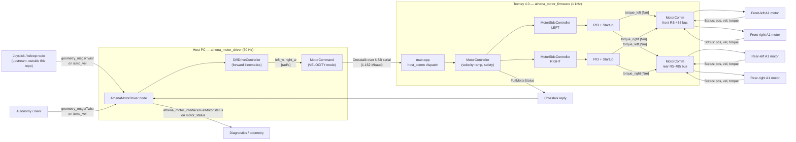
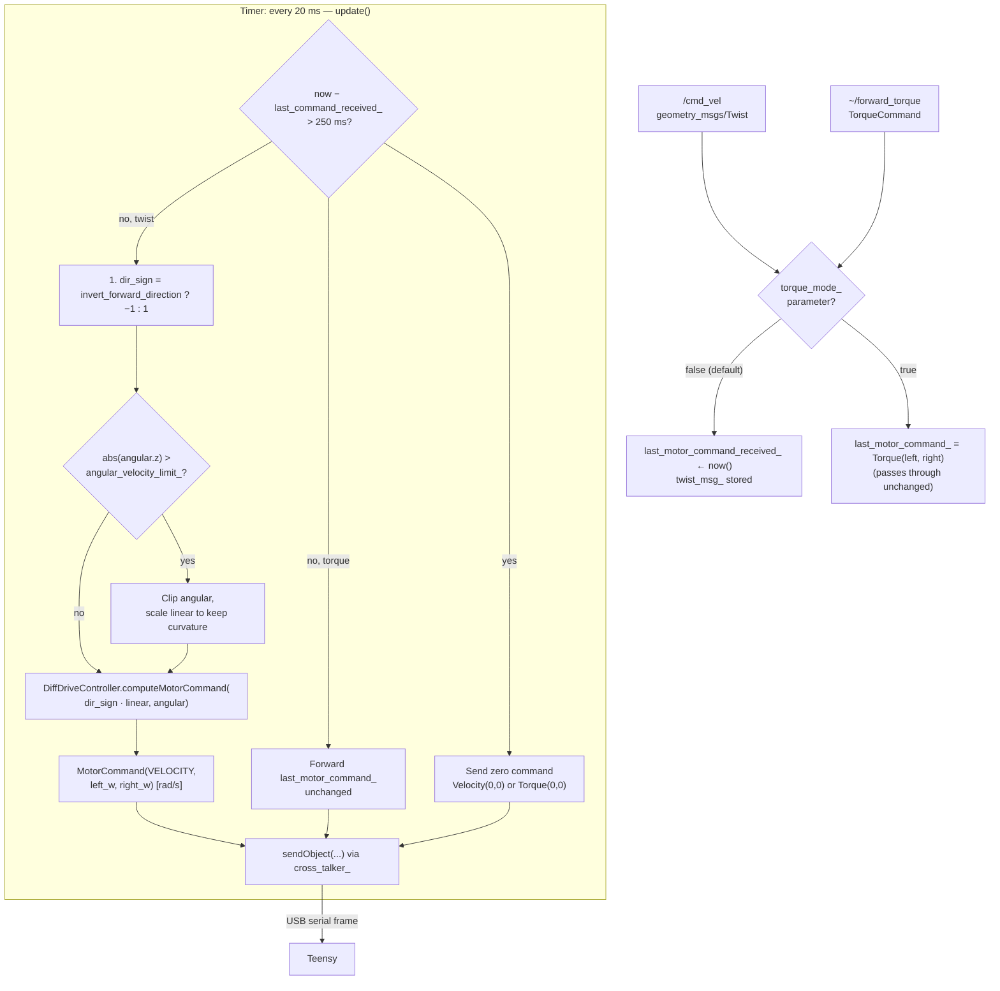
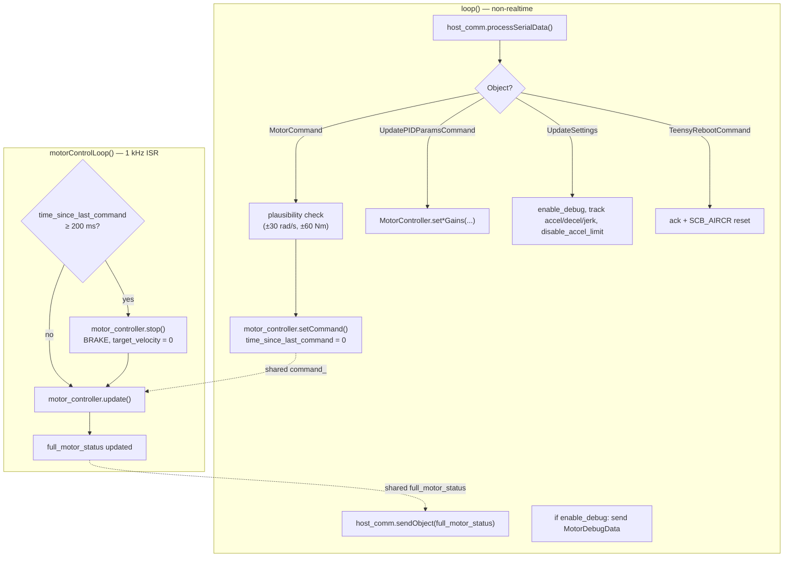
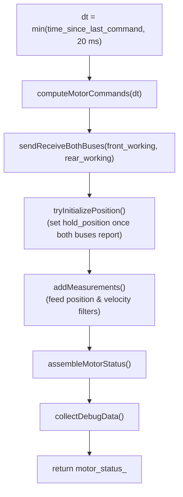
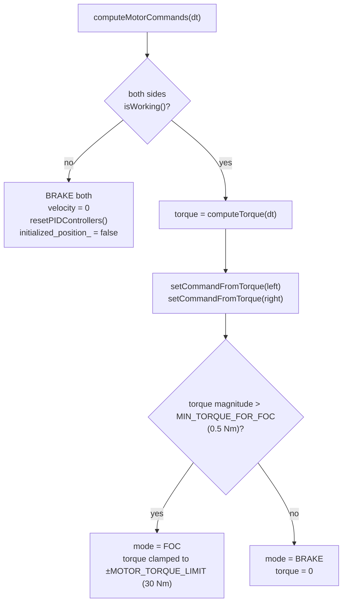
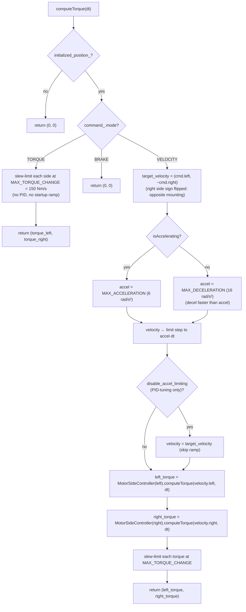
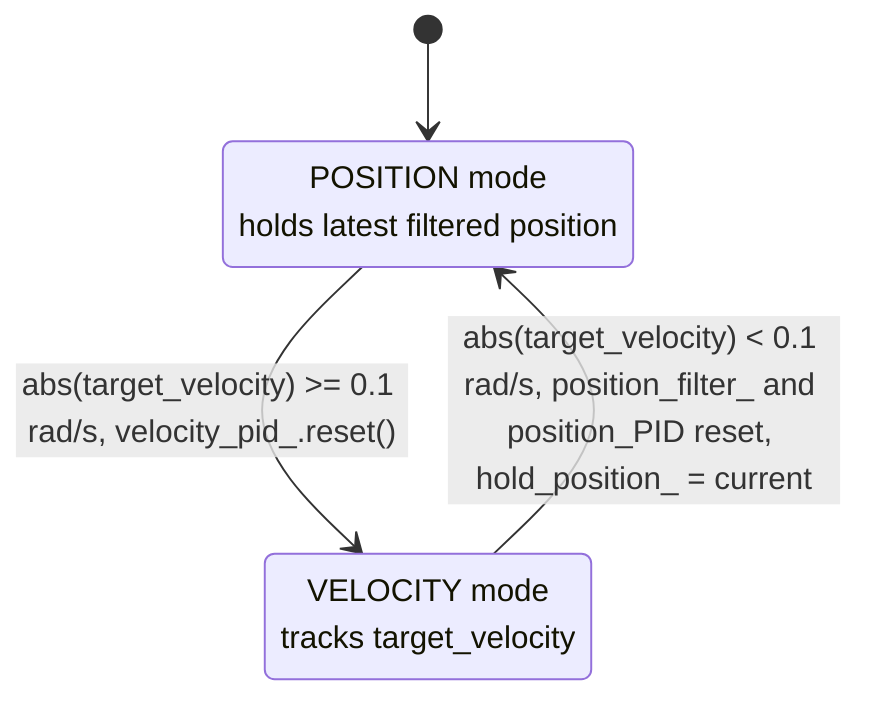
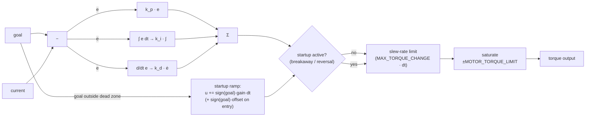

# Athena Drive Control Architecture

This document describes the control pipeline that translates a high-level
operator intent (joystick / teleop) into low-level torque commands on the four
Unitree A1 motors that drive Athena's tracks.

The pipeline is split across two physical processors:

| Stage | Where it runs | Loop rate |
|---|---|---|
| Twist → wheel velocity setpoint | ROS 2 driver (`athena_motor_driver`, host PC) | 50 Hz |
| Wheel velocity → motor torque | Teensy 4.0 firmware (`athena_motor_firmware`) | 1000 Hz |
| FOC torque tracking | Unitree A1 motor MCU | internal |

The host PC and the Teensy talk over USB serial using the
[Crosstalk](https://github.com/StefanFabian/crosstalk) framing protocol. The
Teensy talks to the four motors over two redundant RS-485 buses (front bus and
rear bus), each carrying one left motor (`motor_id = 0`) and one right motor
(`motor_id = 1`).

## 1. End-to-end overview

Key idea: the ROS driver only does kinematics (Twist → per-side wheel rate). All
real-time control (velocity ramp, PID, startup ramp, position hold, FOC torque
generation) lives on the Teensy because it runs deterministically at 1 kHz.

## 2. Host-side: from `/cmd_vel` to wheel velocity setpoint

The ROS node `AthenaMotorDriver` (`athena_motor_driver/src/athena_motor_driver.cpp`)
runs a 20 ms timer (`update()`). On each tick it picks the most recent input,
applies safety limits, computes per-side wheel velocities, and serializes a
`MotorCommand` over Crosstalk.

### 2.1 Differential-drive forward kinematics

Implemented in `src/controllers/diff_drive_controller.cpp`. With

- `L` = `wheel_separation` (m)
- `r` = `wheel_radius` (m)
- `α` = `rotational_amplification`

the per-side wheel angular velocities are

\[
\omega_{\text{left}} = \frac{v_x - \alpha \cdot \omega_z \cdot L/2}{r},
\qquad
\omega_{\text{right}} = \frac{v_x + \alpha \cdot \omega_z \cdot L/2}{r}.
\]

`rotational_amplification > 1` pre-amplifies in-place yaw commands so the
operator gets responsive turning despite high track friction. The angular
velocity is also clamped to `angular_velocity_limit_` *before* this
computation, with `linear` scaled proportionally so the commanded curvature is
preserved (see `update()` in `athena_motor_driver.cpp`).

### 2.2 Safety / timeouts on the host

- **250 ms command timeout** (`last_motor_command_received_ + 250ms < now()`):
  if no upstream command (Twist or Torque) arrives, the driver injects a
  zero command. This protects against an upstream node freezing.
- **Mode gating**: when `torque_mode_` is true, the `/cmd_vel` callback is a
  no-op (and vice versa) so the two modes can never fight.
- **Velocity sanity** is enforced one layer down, in the firmware
  (`MAX_PLAUSIBLE_VELOCITY_COMMAND = 30 rad/s`).

### 2.3 Other host responsibilities

- **PID/startup gains**: declared as ROS parameters; whenever any of them
  is reconfigured, `pid_updated_` is set and on the next `update()` tick a
  `UpdatePIDParamsCommand` is sent to the Teensy.
- **`UpdateSettings`**: enables/disables debug data, the
  `disable_acceleration_limiting` flag (PID-tuning only — bypasses the velocity
  reference ramp), plus **`max_track_acceleration_rad_s2`** /
  **`max_track_deceleration_rad_s2`** /
  **`max_track_jerk_rad_s3`** (Teensy reference ramp tuning) and
  **`derivative_filter_cutoff_hz`** (PID derivative filter).
- **`~/reboot` service**: forwards a `TeensyRebootCommand` over Crosstalk and
  closes the serial port; the firmware reboots, which causes USB to re-enumerate.
- **Status fan-out**: `FullMotorStatus` packets coming back from the Teensy are
  republished on `motor_status`. `MotorDebugData` is republished on `~/debug_data`
  when `enable_debug` is true.

## 3. Firmware-side: from commanded track angular rate to motor torque

The firmware (`athena_motor_firmware/src/main.cpp`) has two concurrent
contexts:

- **`loop()`** — non-time-critical: handles host serial (Crosstalk dispatch),
  publishes `FullMotorStatus`, errors, and debug data.
- **`motorControlLoop()`** — runs from an `IntervalTimer` ISR every
  `MAIN_LOOP_PERIOD_US = 1000 µs` (1 kHz). This is the real-time control loop.

Note: the host-driver timeout is 250 ms; the firmware-side timeout is 200 ms.
This means the firmware will brake first if the host is silent — even if the
host driver is alive but its upstream is silent, the firmware also catches
that case independently because the host then sends `Velocity(0,0)`.

### 3.1 `MotorController::update()`

Called every 1 ms. The dt passed to PIDs is capped at 20 ms to keep the
observer/integrator stable after pauses (e.g. after an E-stop or a USB drop).

`sendReceiveBothBuses` interleaves TX/RX on the two RS-485 buses so the
front and rear motors can process their commands in parallel. If a bus has
been dead for too many cycles (`MAX_RESET_SKIP_COUNT = 10`), the firmware
resets that bus and skips it for one cycle to recover.

### 3.2 `computeMotorCommands` — torque selection

Two important behaviors:

- If a side has no working motor in `MOTOR_STATUS_TIMEOUT_MS = 20 ms`, both
  sides are forcibly braked and the position controller is invalidated (so it
  cannot snap back to a stale hold-position when comms recover).
- If torque magnitude is below `MIN_TORQUE_FOR_FOC = 0.5 Nm`, the firmware
  drops to `BRAKE` mode for that motor instead of sending a tiny FOC command.
  This avoids parasitic noise / heating at zero output.

### 3.3 `MotorController::computeTorque` — velocity ramp + per-side PID

This is the core kinematic-to-torque conversion for the **velocity** path.
(The torque path skips most of this — it just slew-rate-limits the host's
torque request.)

The asymmetric accel/decel limits are intentional: starting up gently keeps
chains/tracks happy, but stopping needs to be authoritative. Static friction at
breakaway is handled per-side inside the PID by the startup ramp (see
`left_velocity_startup` / `right_velocity_startup`), not by a separate
torque-stage term.

### 3.4 `MotorSideController::computeTorque` — position hold ↔ velocity tracking

Each side automatically chooses between a **position-hold PID** (when commanded
velocity is below `VELOCITY_DEAD_ZONE = 0.1 rad/s`) and a **velocity-tracking
PID** otherwise. This means a stationary command does not let the robot creep
on a slope — the position PID actively resists external pushes.

Position and velocity are estimated by fusing the front and rear motor
readings (each side has two motors) through `PositionMeasurementFilter` and
`VelocityMeasurementFilter`. This gives redundancy: if the front motor on the
left side drops out, the rear-left reading still drives the controller.

### 3.5 PID + startup kernel

`PIDController::computeTorque(goal, current, dt)` implements

\[
u_\text{pid} = k_p \cdot e + k_i \cdot \!\!\int e\, dt + k_d \cdot \dot e,
\]

where \(e = \text{goal} - \text{current}\).

When the wheel must break away from rest (or reverse direction) — i.e.
\(|\text{goal}|\) is above `STARTUP_DEAD_ZONE = 0.1` (rad/s for velocity,
rad for position), the startup `gain` is positive, and the wheel is not yet
measured moving in the commanded direction — the kernel temporarily
**replaces** the PID output with an open-loop startup ramp to overcome static
friction:

\[
u_\text{startup} \leftarrow u_{t-1} + \operatorname{sign}(\text{goal}) \cdot \text{offset},
\qquad
u_\text{startup} \mathrel{+}= \operatorname{sign}(\text{goal}) \cdot \text{gain} \cdot dt.
\]

`offset` (Nm) is a one-time step applied on entry; `gain` (Nm/s) is the ramp
rate held until the wheel is measured moving in the commanded direction. On
exit the integrator is seeded so \(k_p e + k_i\!\int + k_d\dot e\) equals the
last startup output, giving a bumpless hand-off back to the PID.

Output limiting is two-stage:

1. Slew-rate clamp: \(|u_t - u_{t-1}| \le \text{MAX\_TORQUE\_CHANGE} \cdot dt\).
2. Saturation clamp: \([-\text{MOTOR\_TORQUE\_LIMIT}, +\text{MOTOR\_TORQUE\_LIMIT}]\).

Same structure is reused for both the velocity loop and the position loop on
each side; only the gains and the meaning of `goal`/`current` differ.

## 4. Wire-level: motor command framing

`MotorComm` packages the 16-bit fixed-point payload required by the Unitree A1
motor:

- **TX**: 34-byte command frame containing `motor_id`, `mode`, `torque`, plus
  unused `velocity`/`position`/`k_p`/`k_w` fields and a CRC32.
- **RX**: 78-byte status frame with measured `torque`, two velocity bands,
  `position`, `temperature`, and an `error_code`, also CRC32-checked.

Even though the A1 motor supports a built-in stiffness controller (`k_p`,
`k_w`), Athena drives the motor in **pure FOC torque mode** — i.e. it always
sends `mode = FOC` with `k_p = k_w = 0` and the torque it computed. All
control intelligence stays on the Teensy.

The Teensy interleaves the two buses (front / rear) so that:

1. Send LEFT command on front bus *and* on rear bus (parallel).
2. Read LEFT status from front bus and rear bus.
3. Send RIGHT command on front bus and rear bus.
4. Read RIGHT status from both.

This roughly halves the per-cycle bus blocking time vs. a strictly serial
implementation.

## 5. Layered safety summary

```mermaid
flowchart LR
    subgraph U["Upstream"]
        UP["Joystick / nav / autonomy"]
    end

    subgraph H["Host driver (50 Hz)"]
        H1["torque_mode gating"]
        H2["angular_velocity_limit clamp<br/>(curvature-preserving)"]
        H3["250 ms upstream-silence ⇒ zero command"]
    end

    subgraph T["Teensy (1 kHz)"]
        T1["plausibility: ±30 rad/s, ±60 Nm"]
        T2["200 ms host-silence ⇒ stop()"]
        T3["accel ramp: +6 / −16 rad/s²"]
        T4["per-side PID + FF<br/>output ±30 Nm, slew 150 Nm/s"]
        T5["20 ms motor-status timeout ⇒ BRAKE"]
        T6["bus reset / skip on comm failure"]
        T7["min-torque dead-zone ⇒ BRAKE not FOC"]
    end

    subgraph M["Motor"]
        M1["A1 firmware FOC limits"]
    end

    UP --> H1
    H1 --> H2 --> H3 --> T1 --> T2 --> T3 --> T4 --> T5 --> T6 --> T7 --> M1
```

Every layer has its own independent fallback to **stop the tracks**, and the
fallbacks bracket each other (host timeout > firmware timeout > motor-status
timeout). This is what lets a USB cable yank, a `ros2 launch` kill, or a single
RS-485 bus failure all fail safe instead of leaving the motors driving.

## 6. Where to look in the code

| Concern | File |
|---|---|
| ROS node, topic plumbing, parameters | `athena_motor_driver/src/athena_motor_driver.cpp` |
| Twist → wheel velocity (forward kinematics) | `athena_motor_driver/src/controllers/diff_drive_controller.cpp` |
| Crosstalk / serial wrapper | `athena_motor_driver/src/crosstalk_lib_serial_wrapper.hpp` |
| Wire types (`MotorCommand`, `FullMotorStatus`, ...) | `athena_motor_interface/include/athena_motor_interface/athena_motor_interfaces.h` |
| Teensy main loop + Crosstalk dispatch | `athena_motor_firmware/src/main.cpp` |
| Velocity ramp, dual-bus orchestration, mode selection | `athena_motor_firmware/src/motor_controller.cpp` |
| Per-side position/velocity mode switch + filtering | `athena_motor_firmware/src/motor_side_controller.cpp` |
| PID + startup kernel | `athena_motor_firmware/src/pid_controller.cpp` |
| All tunable constants (timeouts, limits, gains) | `athena_motor_firmware/include/config.h` |
| Default ROS-side gains and kinematics | `athena_motor_driver/config/params.yaml` |
